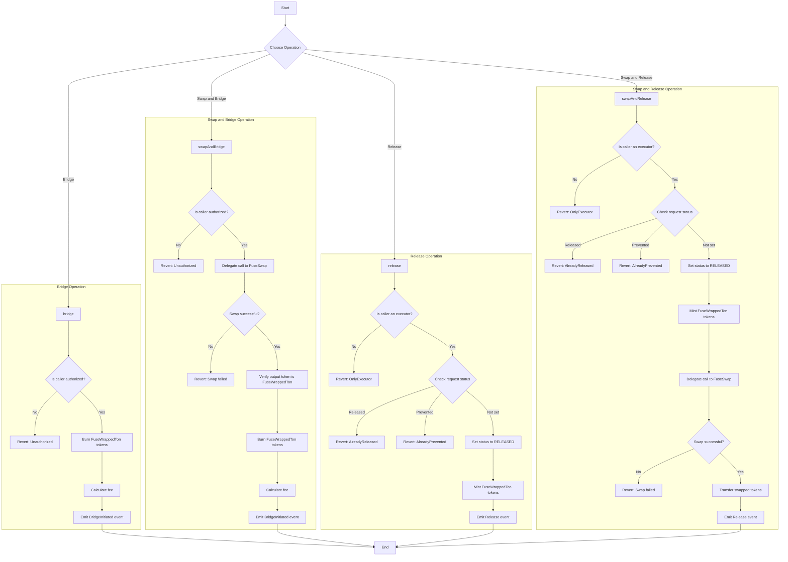
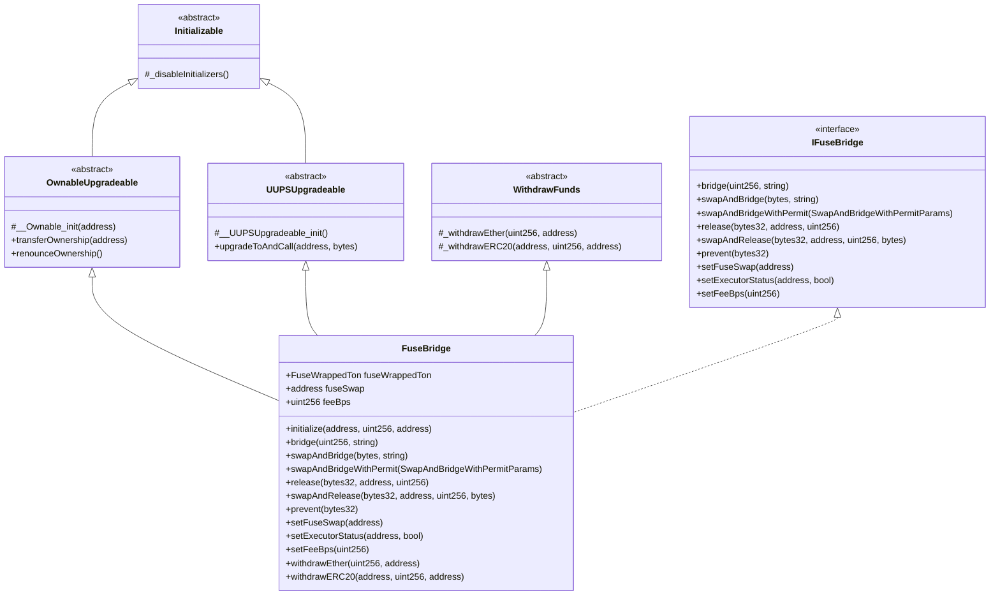
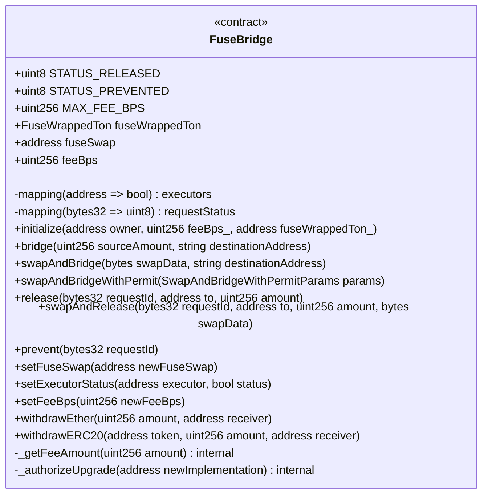
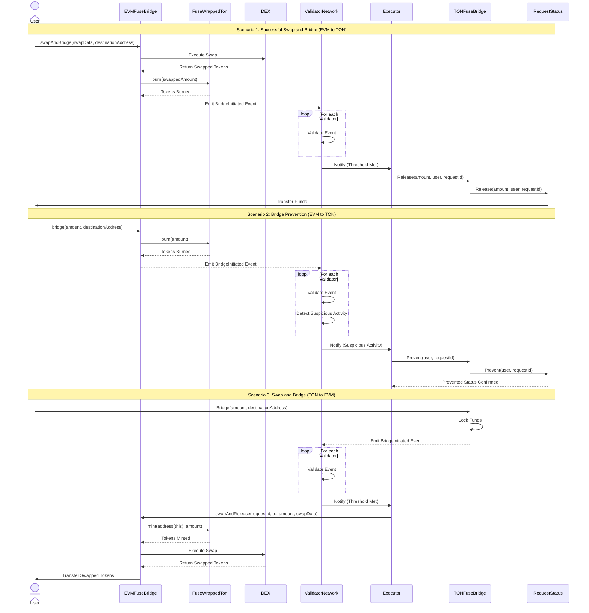
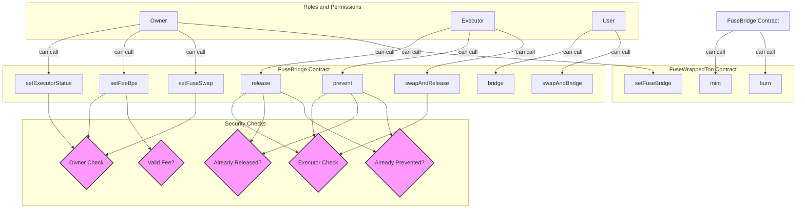

# FuseBridge Review

FuseBridge contract provides a comprehensive solution for bridging tokens between networks, with features for swapping, permitting, and managing the bridging process. It incorporates important security measures, upgradeability, and flexibility in its design, making it a robust system for cross-chain token transfers. The contract verifies the caller's authorization, checking request statuses to prevent double-spending, and using a delegate call mechanism for swaps to maintain the contract's context. The fee calculation and event emissions provide transparency and allow for off-chain tracking of bridge operations.

The core functionality of the FuseBridge contract, enables:

1. Bridging of tokens from one network to another
2. Swapping tokens before bridging
3. Releasing bridged tokens on the destination network
4. Swapping tokens upon release on the destination network

### Main operations flowchart

1. Bridge Operation:

The user calls the `bridge` function with the amount to bridge and the destination address.
The contract checks if the caller is authorized (this is implied in the contract through the use of tokens).
If authorized, the contract burns the specified amount of FuseWrappedTon tokens from the caller's account.
The contract calculates the fee based on the bridged amount.
Finally, it emits a BridgeInitiated event with the details of the transaction.

2. Swap and Bridge Operation:

The user calls the `swapAndBridge` function with swap data and the destination address.
The contract checks if the caller is authorized.
If authorized, it performs a delegate call to the FuseSwap contract to execute the swap.
If the swap is successful, it verifies that the output token is FuseWrappedTon.
The contract then burns the received FuseWrappedTon tokens.
It calculates the fee based on the bridged amount.
Finally, it emits a BridgeInitiated event.

3. Release Operation:

An executor calls the `release` function with the request ID, recipient address, and amount.
The contract checks if the caller is an authorized executor.
If authorized, it checks the status of the request.
If the request is not already released or prevented, it sets the status to RELEASED.
The contract mints the specified amount of FuseWrappedTon tokens to the recipient.
It emits a Release event with the transaction details.

4. Swap and Release Operation:

An executor calls the `swapAndRelease` function with the request ID, recipient address, amount, and swap data.
The contract checks if the caller is an authorized executor.
If authorized, it checks the status of the request.
If the request is not already released or prevented, it sets the status to RELEASED.
The contract mints the specified amount of FuseWrappedTon tokens to itself.
It performs a delegate call to the FuseSwap contract to execute the swap.
If the swap is successful, it transfers the swapped tokens to the recipient.
Finally, it emits a Release event with the transaction details.

### Contract Structure and Inheritance

This class diagram shows the inheritance structure and the main components of the FuseBridge contract.

### Key Components and State Variables

1. Constants:

- `STATUS_RELEASED` (uint8): Represents the status of a released transaction (value: 0x01).
- `STATUS_PREVENTED` (uint8): Represents the status of a prevented transaction (value: 0x02).
- `MAX_FEE_BPS` (uint256): The maximum fee in basis points (value: 500, equivalent to 5%).

2. State Variables:

- `fuseWrappedTon` (FuseWrappedTon): Address of the FuseWrappedTon token contract.
- `fuseSwap` (address): Address of the FuseSwap contract used for token swaps.
- `feeBps` (uint256): Current fee in basis points for bridge operations.
- `executors` (mapping): A mapping of addresses to boolean values, tracking authorized executors.
- `requestStatus` (mapping): A mapping of request IDs (bytes32) to their status (uint8).

3. Main Functions:

- `initialize`: Initializes the contract with owner, fee, and FuseWrappedTon address.
- `bridge`: Handles the basic bridge operation.
- `swapAndBridge`: Performs a swap before bridging.
- `swapAndBridgeWithPermit`: Similar to swapAndBridge but uses EIP-2612 permit for approval.
- `release`: Releases bridged tokens on the destination chain.
- `swapAndRelease`: Swaps tokens upon release on the destination chain.
- `prevent`: Prevents a specific bridge request from being executed.

4. Administrative Functions:

- `setFuseSwap`: Sets the address of the FuseSwap contract.
- `setExecutorStatus`: Adds or removes an address from the list of authorized executors.
- `setFeeBps`: Updates the fee in basis points.
- `withdrawEther`: Allows the owner to withdraw Ether from the contract.
- `withdrawERC20`: Allows the owner to withdraw ERC20 tokens from the contract.

5. Internal Functions:

- `_getFeeAmount`: Calculates the fee amount for a given source amount.
- `_authorizeUpgrade`: Authorizes an upgrade (part of the UUPS upgrade pattern).

### Sequence Diagram

This sequence diagram illustrates the detailed flow of a bridging operation, including the swap and prevent scenarios.

### Key Functions Explained

1. `bridge(uint256 sourceAmount, string calldata destinationAddress)`

- Purpose: Initiates a bridge operation from EVM to TON.
- Functionality:
  - Burns the specified amount of FuseWrappedTon tokens from the sender.
  - Calculates and deducts the fee.
  - Emits a BridgeInitiated event with the remaining amount.

2. `swapAndBridge(bytes calldata swapData, string calldata destinationAddress)`

- Purpose: Allows users to swap tokens and then bridge in one transaction.
- Functionality:
  - Executes a swap operation using the provided swap data.
  - Burns the resulting FuseWrappedTon tokens.
  - Emits a BridgeInitiated event.

2. `swapAndBridgeWithPermit(SwapAndBridgeWithPermitParams calldata params)`

- Purpose: Similar to swapAndBridge, but uses EIP-2612 permit for approval.
- Functionality:
  - Attempts to execute the permit function for token approval.
  - Calls swapAndBridge with the approved tokens.

3. `release(bytes32 requestId, address to, uint256 amount)`

- Purpose: Releases tokens on the EVM chain for completed TON-to-EVM bridges.
- Access: Only callable by authorized executors.
- Functionality:
  - Checks if the request has already been processed.
  - Mints FuseWrappedTon tokens to the specified address.
  - Emits a Release event.

4. `swapAndRelease(bytes32 requestId, address to, uint256 amount, bytes calldata swapData)`

- Purpose: Releases tokens and immediately swaps them for the user.
- Access: Only callable by authorized executors.
- Functionality:
  - Mints FuseWrappedTon tokens to the contract.
  - Executes a swap operation.
  - Transfers the resulting tokens to the user.
  - Emits a Release event.

5. `prevent(bytes32 requestId)`

- Purpose: Prevents a specific bridge request from being processed.
- Access: Only callable by authorized executors.
- Functionality:
  - Marks a request as prevented, blocking its future processing.
  - Emits a Prevent event.

6. `setFuseSwap(address newFuseSwap)`

- Purpose: Sets the address of the FuseSwap contract used for token swaps.
- Access: Only callable by the contract owner.
- Functionality: Updates the FuseSwap contract address.

7. `setExecutorStatus(address executor, bool status)`

- Purpose: Manages the list of authorized executors.
- Access: Only callable by the contract owner.
- Functionality: Adds or removes executors who can call sensitive functions.

8. `setFeeBps(uint256 newFeeBps)`

- Purpose: Updates the fee percentage for bridge operations.
- Access: Only callable by the contract owner.
- Functionality: Sets a new fee in basis points (BPS).

### Security and Access Control

### Key components

1. Roles and Permissions:

- Owner: Has the highest level of control, can manage executors and set critical parameters.
- Executor: Can perform sensitive operations like releasing funds or preventing transactions.
- User: Can initiate bridge and swap operations.

2. FuseBridge Contract:

- Contains the main functions for bridging operations and system management.
- Functions are color-coded based on who can access them.

3. FuseWrappedTon Contract:

- Contains functions for minting and burning wrapped tokens.
- Can only be called by the FuseBridge contract for security.

4. Security Checks:

- Represented by diamond shapes, these are critical checkpoints in the system.
- Include checks for executor status, owner status, transaction status (released/prevented), and fee validity.

### Key Security Features Illustrated:

1. Role-Based Access Control:

- Clear separation of functions accessible by Owner, Executor, and User.
- Owner has exclusive access to system configuration functions.
- Executors have exclusive access to sensitive operational functions.

2. Multi-Step Verification:

- Functions like `release` and `prevent` go through multiple checks (executor status, transaction status).

3. Parameter Validation:

- Fee changes are validated to ensure they're within acceptable limits.

4. Restricted Token Operations:

- Only the FuseBridge contract can mint or burn FuseWrappedTon tokens.

5. State Checks:

- Prevents double-processing of transactions (`release` or `prevent`) through status checks.

### Upgradeability

The contract uses the UUPS (Universal Upgradeable Proxy Standard) pattern:

- The `_authorizeUpgrade` function is overridden to restrict upgrades to the contract owner.
- The `upgradeToAndCall` function (inherited from UUPSUpgradeable) allows for upgrading the contract implementation.

### Fund Management

The contract includes functions for withdrawing both Ether and ERC20 tokens:

- `withdrawEther(uint256 amount, address receiver)`
- `withdrawERC20(address token, uint256 amount, address receiver)`

These functions are restricted to the contract owner and use the `WithdrawFunds` abstract contract for implementation.

### Events and Error Handling

The contract emits several events for important actions:

`BridgeInitiated`: When a bridge operation is started.
`Release`: When tokens are released on the destination chain.
`Prevent`: When a bridge request is prevented.
`SetFuseSwap`, `SetExecutorStatus`, `SetFeeBps`: For administrative actions.

Custom errors are used for better gas efficiency and more informative error messages:

`OnlyFuseBridge`, `OnlyExecutor`, `InvalidFeeBps`, `AlreadyReleased`, `AlreadyPrevented`, `InvalidAddress`
