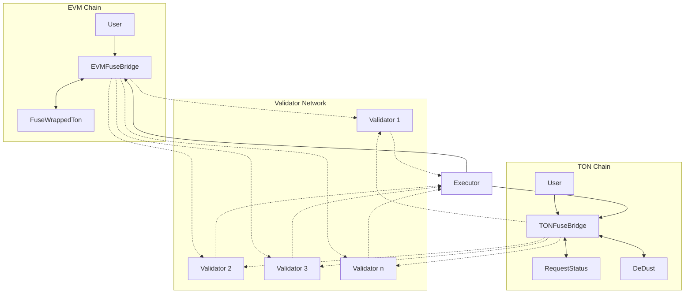
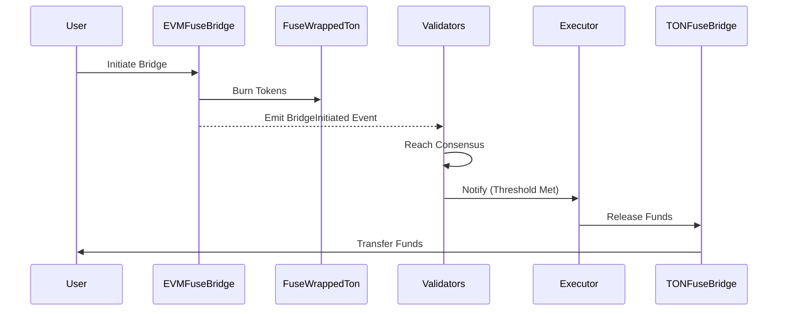
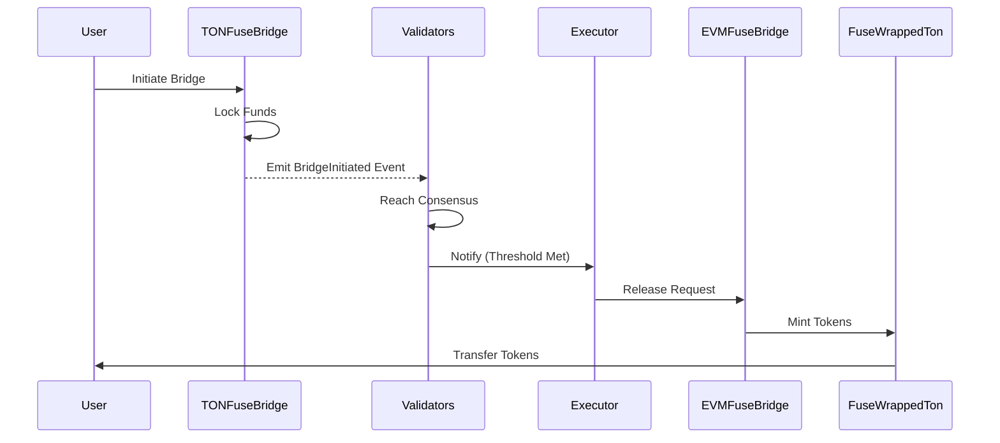
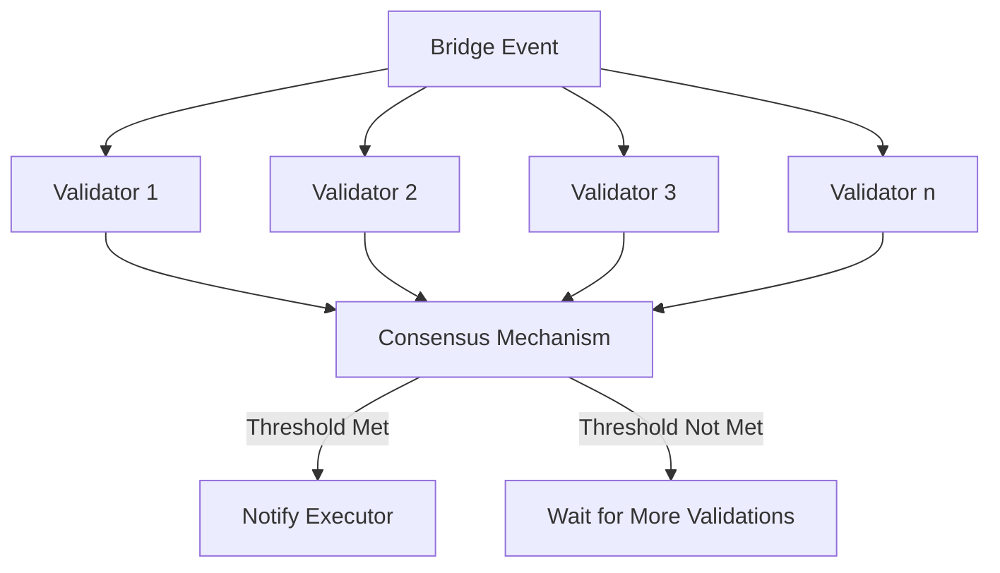
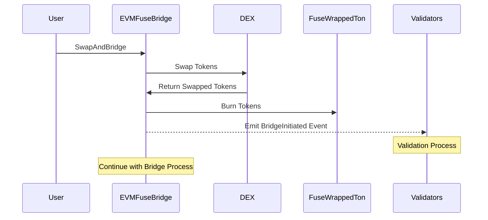

# FuseBridge

The FuseBridge is a cross-chain bridge system designed to facilitate asset transfers between EVM-compatible chains and the TON blockchain. It consists of several key components working together to ensure secure and efficient cross-chain transactions.

## Key Components

1. **EVM-side Contracts**

   - FuseWrappedTon: An ERC20 token representing wrapped TON on EVM chains.
   - EVMFuseBridge: The main bridge contract on EVM chains.

2. **TON-side Contracts**

   - TONFuseBridge: The main bridge contract on the TON blockchain.
   - RequestStatus: A contract to manage the status of individual bridge requests.

3. **Validator Network**

   - A decentralized network of validators that observe and validate cross-chain events.

4. **Executor**

   - Responsible for executing validated bridge requests.

5. **DEX Integration**
   - Enables token swaps as part of the bridging process.

## Core Processes

1. **Bridging from EVM to TON**

   - User initiates a bridge transaction on the EVM-side.
   - EVMFuseBridge burns FuseWrappedTon tokens.
   - Validators observe and validate the event.
   - Once the threshold is reached, the Executor is notified.
   - TONFuseBridge releases funds on the TON side.

2. **Bridging from TON to EVM**

   - User initiates a bridge transaction on the TON-side.
   - TONFuseBridge locks the funds.
   - Validators observe and validate the event.
   - Once the threshold is reached, the Executor is notified.
   - EVMFuseBridge mints FuseWrappedTon tokens on the EVM side.

3. **Swap and Bridge**

   - Users can swap tokens before bridging on either side.
   - On EVM, this is handled within the EVMFuseBridge contract.
   - On TON, this utilizes the DeDust integration.

4. **Validation Process**

   - Validators independently observe events on both chains.
   - They reach a consensus based on a predefined threshold.
   - Once the threshold is met, the Executor is notified to process the transaction.

5. **Execution Process**
   - The Executor receives notifications from the validator network.
   - It then initiates the corresponding action (minting, releasing, or preventing) on the appropriate chain.

This architecture ensures a secure, decentralized, and efficient cross-chain bridging process, leveraging the strengths of both EVM-compatible chains and the TON blockchain.

## System Overview

## EVM to TON Bridging Process

## TON to EVM Bridging Process

## Validator Consensus Process

## Swap and Bridge Process

## FuseBridge Security Analysis Summary

### 1. Validator Network Security

- **Strength**: Decentralized network with threshold-based consensus.
- **Risk**: Potential for collusion if validator selection is not properly managed.
- **Mitigation**: Implement transparent validator selection and rotation mechanisms.

### 2. Cross-Chain Communication

- **Risk**: Inconsistent event verification across chains.
- **Mitigation**: Implement robust event verification and consensus mechanisms among validators.

### 3. Smart Contract Vulnerabilities

- **Risks**: Reentrancy, integer overflow/underflow, unauthorized upgrades.
- **Mitigations**:
  - Use reentrancy guards and follow checks-effects-interactions pattern.
  - Utilize SafeMath or Solidity 0.8.x's built-in checks.
  - Implement multi-signature and time-locked upgrades.

### 4. Token Security

- **Risk**: Vulnerabilities in wrapped token (FuseWrappedTon) contract.
- **Mitigation**: Regular audits, implement pausability, strict access controls.

### 5. Liquidity Risks

- **Risk**: Imbalanced liquidity across chains.
- **Mitigation**: Implement dynamic fees, partner with liquidity providers.

### 6. External Dependencies

- **Risk**: Vulnerabilities in integrated protocols (e.g., DeDust).
- **Mitigation**: Regular audits, circuit breakers, ability to pause integrations.

### 7. Governance and Access Control

- **Risk**: Centralized control of critical functions.
- **Mitigation**: Implement decentralized governance, multi-signature controls.

### 8. Network Resilience

- **Risks**: Validator downtime, network partitions.
- **Mitigations**: Dynamic threshold adjustment, partition recovery mechanisms.

### 9. Performance and Scalability

- **Risk**: Slow consensus as the network grows.
- **Mitigation**: Optimize consensus mechanism, consider layer-2 solutions.

### 10. Operational Security

- **Risks**: Poor key management, delayed incident response.
- **Mitigations**: Robust key management practices, comprehensive monitoring and incident response plans.

### Key Recommendations

1. Regular smart contract audits.
2. Implement comprehensive testing and formal verification.
3. Develop detailed monitoring systems.
4. Gradually decentralize governance.
5. Implement emergency pause functionality.
6. Regular updates and dependency reviews.
7. Consider insurance or guarantee funds for user protection.
8. Continuous validator training and compliance programs.
9. Implement a bug bounty program.
10. Regular security simulations and drills.
